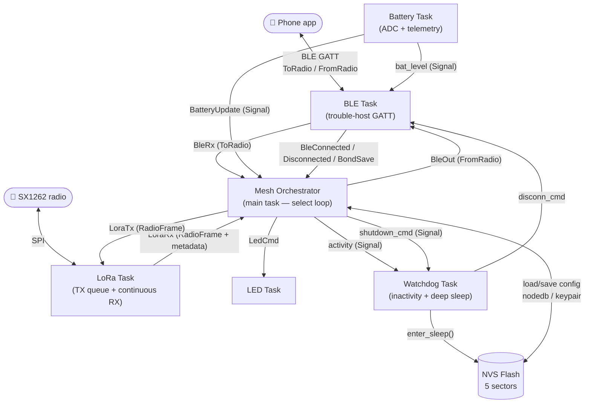
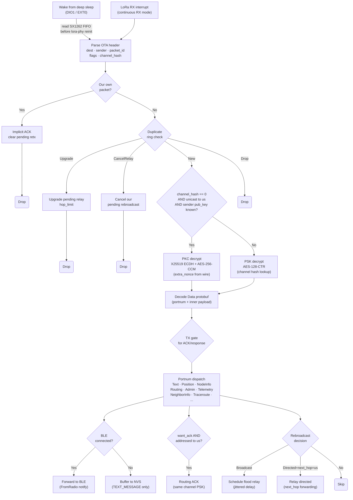
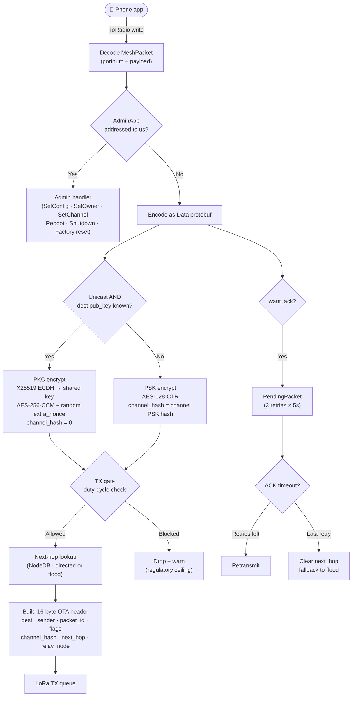
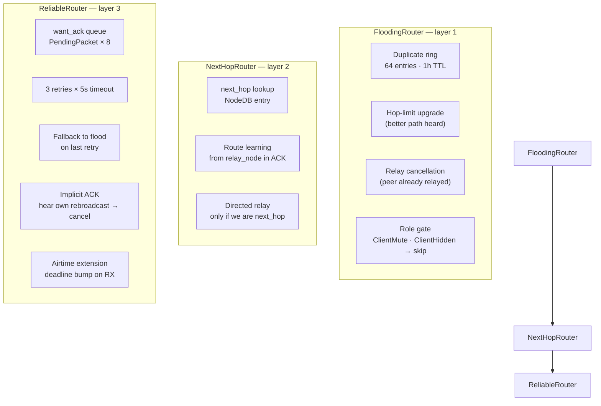
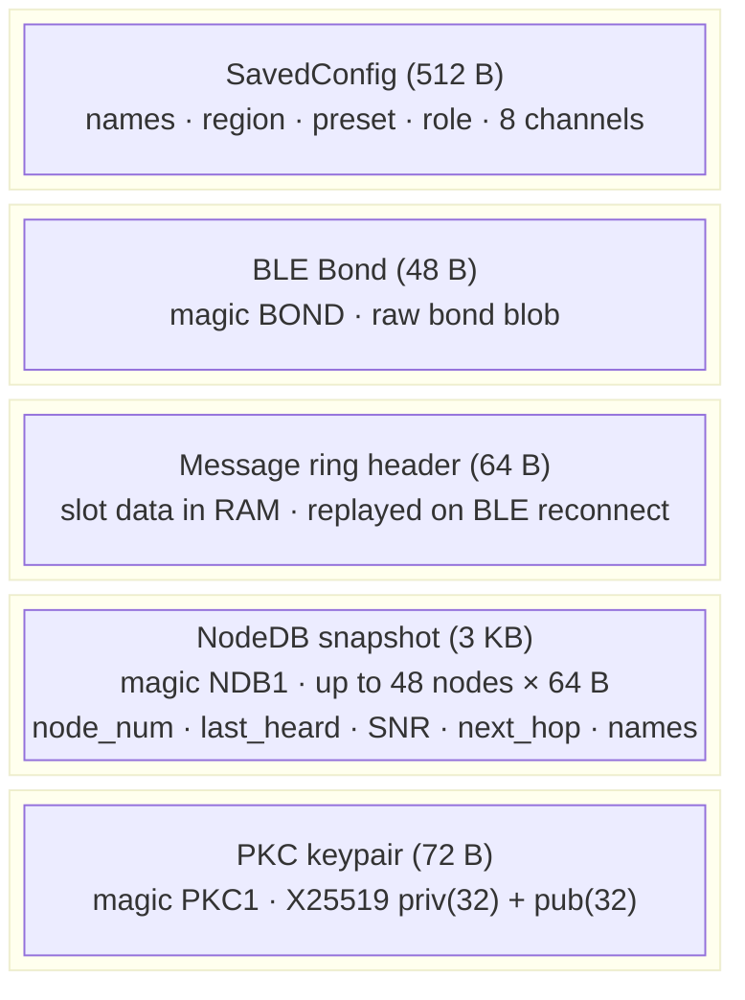
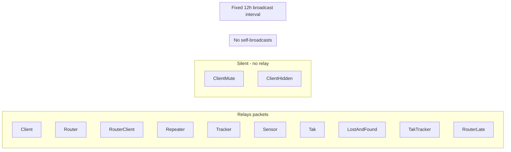

# Meshtastenstein

Meshtastic protocol firmware in Rust for the **Heltec WiFi LoRa 32 V3** (ESP32-S3 + SX1262).

A from-scratch implementation of the Meshtastic mesh networking protocol stack — radio, BLE, crypto, hierarchical routing, node management, and config persistence — written entirely in `no_std` Rust using the Embassy async executor.

---

## Hardware Target

| Component | Details |
|-----------|---------|
| MCU | ESP32-S3 (dual-core Xtensa LX7, 512 KB DRAM) |
| Radio | SX1262 LoRa transceiver |
| Board | Heltec WiFi LoRa 32 V3 |
| Toolchain | Xtensa ESP (`esp` channel via `rust-toolchain.toml`) |

### Pin mapping

| Signal | GPIO |
|--------|------|
| LoRa SPI SCK | 9 |
| LoRa SPI MISO | 11 |
| LoRa SPI MOSI | 10 |
| LoRa CS | 8 |
| LoRa RESET | 12 |
| LoRa DIO1 | 14 |
| LoRa BUSY | 13 |
| LED | 35 |
| Battery ADC | GPIO1 (ADC1) |
| Battery ADC ctrl | GPIO37 |

---

## Features

- **Meshtastic BLE API** — full GATT service (ToRadio / FromRadio / FromNum), MTU-correct read replies, notifications, secure pairing with PIN display, bond persistence across reboots
- **LoRa mesh** — Meshtastic packet framing (16-byte OTA header), sync word 0x2B, preamble 16 symbols, AES-128-CTR encryption, CRC, configurable modem preset and region
- **Hierarchical routing** — 3-layer architecture matching the C++ firmware: FloodingRouter (duplicate detection, relay cancellation, hop-limit upgrade), NextHopRouter (directed next-hop routing, route learning from ACKs), ReliableRouter (want_ack retransmission with fallback-to-flood)
- **Config exchange** — complete phone app handshake: MyNodeInfo + own NodeInfo + DeviceMetadata + 8 channels + all Config types + all 13 ModuleConfig types + NodeDB + ConfigCompleteId
- **Admin messages** — GetOwner / SetOwner, GetConfig / SetConfig (LoRa + Device), GetChannel / SetChannel, BeginEditSettings / CommitEditSettings, RebootSeconds (deferred software reset), ShutdownSeconds, FactoryReset, NodeDBReset, RemoveNodeByNum
- **Multi-channel support** — up to 8 channels (1 primary + 7 secondary), per-channel PSK encryption, channel-aware ACK routing
- **NodeDB** — up to 64 in-memory nodes, stale eviction (2 h), hops_away tracking, next_hop route learning, synced to phone in config exchange; top-48 snapshot persisted across reboots
- **NVS persistence** — 5-sector flash layout: SavedConfig (names, region, modem preset, role, 8 channels) + BLE bond + message ring buffer + NodeDB snapshot + X25519 keypair
- **Store-and-forward** — TEXT_MESSAGE frames buffered in NVS when BLE disconnected; replayed after next config exchange
- **Battery monitoring** — ADC sampling with voltage-divider compensation (OCV lookup table), telemetry sent as TELEMETRY_APP via LoRa and BLE
- **Periodic broadcasts** — NodeInfo (3 h), Position (15 min), Telemetry (60 min), NeighborInfo (6 h), all with congestion-scaled intervals and duty-cycle TX gating
- **Regulatory duty-cycle compliance** — per-region TX gates (1% EU_868, 10% EU_433, unlimited US); polite ceiling for background traffic, hard ceiling for all TX; rolling 1-hour airtime window
- **X25519 PKC direct messages** — Curve25519 ECDH + AES-256-CCM matching upstream `encryptCurve25519`; keypair persisted to NVS; public key advertised in NodeInfo; auto-selected for unicast DMs when peer key is known
- **Deep sleep** — inactivity watchdog (5 min), low battery auto-sleep, DIO1/button wakeup; `ShutdownSeconds` admin command routes through watchdog task with pre-sleep NodeDB flush
- **LED heartbeat** — 2 s pulse pattern, single blink on LoRa RX, double blink on BLE TX

---

## Use Case Coverage

| Use case | Status | Notes |
|----------|--------|-------|
| **LoRa configuration** (region, preset, hop limit) | ✅ | SetConfig(LoRa) + GetConfig(LoRa); persisted to NVS; applied after RebootSeconds |
| **Channel configuration** (up to 8, per-PSK) | ✅ | SetChannel + GetChannel; Primary + up to 7 Secondary; per-channel AES-128-CTR |
| **Public broadcast messages** | ✅ | TEXT_MESSAGE to BROADCAST_ADDR; flood routing; hop-limit relay; duty-cycle gated |
| **Private direct messages (PSK)** | ✅ | Unicast with channel PSK when peer public key not yet known |
| **Private direct messages (PKC)** | ✅ | X25519 ECDH + AES-256-CCM; auto-selected when peer public key is in NodeDB |
| **Wake from deep sleep on LoRa RX** | ✅ | DIO1 → EXT0 wakeup; SX1262 FIFO packet read before lora-phy reinit |
| **Wake from deep sleep on button** | ✅ | GPIO0 → EXT1 wakeup |
| **Battery-triggered deep sleep** | ✅ | < 5 % SoC triggers immediate deep sleep via watchdog |
| **Inactivity deep sleep** | ✅ | 5 min no BLE/LoRa activity → deep sleep with pre-sleep NodeDB flush |
| **Mesh state across reboots** | ✅ | NodeDB snapshot (top-48 peers) restored on boot; keys re-learned from NodeInfo |
| **Regulatory TX compliance** | ✅ | Per-region duty-cycle gates (1 % EU_868, 10 % EU_433) on all broadcast paths |
| **Multi-hop routing** | ✅ | Flooding + next-hop learning + directed relay + want_ack retransmission |

---

## Architecture

Three-layer design: `domain/` (pure protocol logic, no hardware), `tasks/` (Embassy async tasks), `adapters/` (ESP32 hardware boundary). See [CLAUDE.md](CLAUDE.md) for the full module map.

### Task topology



### Packet receive pipeline



### Packet send pipeline (BLE → LoRa)



### Routing layer



### NVS flash layout



---

## Device Roles

The role is set via `SetConfig(Device)` from the phone app and persisted to NVS. It controls two things: whether the device relays received packets, and how often it broadcasts its own periodic messages.

| Role | Value | Rebroadcast | Periodic broadcasts | Notes |
|------|-------|-------------|---------------------|-------|
| `Client` | 0 | Yes | 3 h NodeInfo, 15 min Position, 60 min Telemetry, 6 h NeighborInfo (congestion-scaled) | **Default** |
| `ClientMute` | 1 | **No** | Same intervals as Client | Receives packets but never relays — use when you don't want to consume airtime for others |
| `Router` | 2 | Yes | Fixed 12 h (all types, no congestion scaling) | Maximum relay priority — always forwards, long broadcast intervals to reduce airtime |
| `RouterClient` | 3 | Yes | Fixed 12 h (same as Router) | *(deprecated in proto but handled)* |
| `Repeater` | 4 | Yes | **Suppressed (0)** | Relay-only — forwards packets but never announces itself *(deprecated in proto)* |
| `Tracker` | 5 | Yes | Congestion-scaled (same as Client) | Duty-cycle sleep not implemented — behaves like Client |
| `Sensor` | 6 | Yes | Congestion-scaled (same as Client) | Duty-cycle sleep not implemented — behaves like Client |
| `Tak` | 7 | Yes | Congestion-scaled (same as Client) | |
| `ClientHidden` | 8 | **No** | **Suppressed (0)** | Fully silent — no relay, no self-announcements; useful for covert or ultra-low-airtime operation |
| `LostAndFound` | 9 | Yes | Congestion-scaled (same as Client) | |
| `TakTracker` | 10 | Yes | Congestion-scaled (same as Client) | |
| `RouterLate` | 11 | Yes | Congestion-scaled (same as Client) | |

### Role behaviour summary



Tracker/Sensor/TAK duty-cycle sleep is **not implemented** — these roles currently behave identically to `Client` aside from the role field being reported in NodeInfo. For implementation details see [CLAUDE.md](CLAUDE.md).

---

## Key Protocol Details

| Parameter | Value |
|-----------|-------|
| Sync word | 0x2B (SX1262 regs 0x0740=0x24, 0x0741=0xB4) |
| Preamble | 16 symbols |
| Default preset | LongFast: SF11, BW 250 kHz, CR 4/5 |
| Default region | EU_433 — 433.625 MHz (slot 2) |
| OTA header | 16 bytes: dest(4) + sender(4) + packet_id(4) + flags(1) + channel_hash(1) + next_hop(1) + relay_node(1) |
| Channel encryption | AES-128-CTR · nonce = packet_id (u64 LE) + sender (u32 LE) + zeros (4) |
| PKC encryption | X25519 ECDH → AES-256-CCM · nonce = packet_id(4) + extra_nonce(4) + sender(4) + 0x00 · tag 8 B · overhead 12 B · channel_hash = 0 |
| Default PSK | `d4f1bb3a20290759f0bcffabcf4e6901` |
| BLE service UUID | `6ba1b218-15a8-461f-9fa8-5dcae273eafd` |
| ToRadio char | `f75c76d2-129e-4dad-a1dd-7866124401e7` (write) |
| FromRadio char | `2c55e69e-4993-11ed-b878-0242ac120002` (read) |
| FromNum char | `ed9da18c-a800-4f66-a670-aa7547e34453` (read + notify) |
| BLE MTU | Android negotiates 508; replies use exact byte length (no zero-padding) |
| NVS layout | Sector 0: SavedConfig 0x0000 (512 B) · Sector 1: Bond 0x1000 (48 B) · Sector 2: msg ring 0x2000 · Sector 3: NodeDB 0x3000 (3 KB) · Sector 4: PKC keypair 0x4000 (72 B) |

### Region frequency table (LongFast / BW 250 kHz)

| Region | Code | Default slot | Frequency |
|--------|------|-------------|-----------|
| US | 1 | 20 | 907.125 MHz |
| EU_433 | 2 | 2 | 433.625 MHz |
| EU_868 | 3 | 0 | 869.525 MHz |
| ANZ | 6 | 20 | 917.125 MHz |

---

## Build

Requires the Xtensa ESP Rust toolchain (managed via `rust-toolchain.toml`):

```bash
# Install espup if needed
cargo install espup
espup install

# Check (no linker needed for type-checking)
cargo check

# Build + flash (requires espflash and the Xtensa toolchain active)
cargo build --release
espflash flash --monitor target/xtensa-esp32s3-none-elf/release/meshtastenstein
```

Set log level via environment variable before flashing:
```bash
RUST_LOG=debug cargo build --release
```

### Protobuf generation

Protobufs live as a git submodule at `proto/meshtastic-protobufs/`. Generated Rust types are committed to `src/proto/`. To regenerate:

```bash
git submodule update --init
cargo build  # triggers build.rs → prost-build
```

---

## Current Status

### Working
- BLE pairing (PIN display), bonding, NVS bond persistence, cross-reboot reconnect
- Full config exchange (app reaches "connected" state)
- LoRa TX from phone to mesh (admin messages, telemetry, text)
- LoRa RX to BLE forwarding (per-portnum dispatch)
- Hierarchical routing: flooding + next-hop learning + directed relay + fallback-to-flood
- Modem preset / region change via app (NVS-persisted, applied after RebootSeconds reboot)
- Multi-channel support (primary + up to 7 secondary channels, per-channel PSK)
- Channel-aware ACK routing (ACK encrypted with same channel PSK as original packet)
- Node identity, NodeInfo broadcast (30 s boot delay, 3 h interval) with public key included; NodeDB sync to phone
- Battery telemetry (ADC with OCV lookup table, LoRa broadcast + BLE GATT 0x180F)
- Deep sleep with DIO1 / button wakeup, low battery auto-sleep; `ShutdownSeconds` triggers real deep sleep via watchdog task
- Duplicate detection (64-entry ring buffer, 1 h TTL) with hop-limit upgrade and relay cancellation
- want_ack retransmission (3 retries x 5 s, fallback to flood on last retry)
- Congestion-scaled periodic broadcasts (NodeInfo, Position, Telemetry, NeighborInfo)
- **Regulatory duty-cycle TX gating** — per-region polite + hard ceilings (Phase 1 G1)
- Role-based rebroadcast (ClientMute/ClientHidden skip; Router always relays)
- Store-and-forward (TEXT_MESSAGE buffered in NVS ring while BLE disconnected)
- Position relay (phone position re-broadcast to mesh every 15 min)
- Traceroute reply (appends node SNR, returns RouteDiscovery on same channel)
- Admin: GetOwner/SetOwner, GetConfig/SetConfig (LoRa + Device), GetChannel/SetChannel, RebootSeconds, ShutdownSeconds (real deep sleep), FactoryReset, NodeDBReset, RemoveNodeByNum, BeginEditSettings, CommitEditSettings
- Incoming Telemetry RX decoded and logged (NodeDB touch, BLE forwarded)
- NeighborInfo RX decoded, neighbor SNR logged and NodeDB-touched, BLE forwarded
- Waypoint and RemoteHardware RX decoded, logged, BLE forwarded
- LED heartbeat (2 s pulse, single blink on LoRa RX, double blink on BLE TX)
- **NodeDB persistence** — top-48 nodes snapshotted to NVS sector 3; restored on boot; debounced 5-min flush + pre-sleep flush
- **X25519 PKC encrypt/decrypt** — AES-256-CCM DMs; keypair generated from hardware TRNG on first boot, persisted to NVS sector 4; peer public keys cached from NodeInfo; auto-selected for unicast DMs

### Known Limitations / TODO
- Rebroadcast delay uses SNR-based jitter — not true CSMA/CA; CAD logic is basic
- No LoRa frequency change without reboot (by design — requires RebootSeconds)
- PKC peer public keys are not persisted in NodeDB snapshot v1 (re-learned from first NodeInfo after reboot; first DM after cold boot falls back to channel PSK)
- Admin session passkey validation not yet enforced (passkey echoed but not checked on incoming admin messages)
- Single region compile-time default; multi-region is runtime via NVS

---

## Hardware Test Checklist

### P0 — Boot & Connectivity

- [ ] **Cold boot**: device powers on, serial log shows MAC, node number, region, preset, frequency
- [ ] **BLE advertising**: phone sees "Meshtastic_XXXX" in scan results
- [ ] **BLE pairing**: PIN displayed on serial, phone pairs successfully
- [ ] **Config exchange**: app reaches "connected" state (MyNodeInfo through ConfigCompleteId sequence)
- [ ] **Bond persistence**: reboot device, phone reconnects without re-pairing
- [ ] **LoRa frequency**: log line `[LoRa] Entering continuous RX mode at X Hz` matches expected formula

### P0 — LoRa Radio

- [ ] **LoRa TX**: send text message from phone, verify `[LoRa] TX` log with correct frequency
- [ ] **LoRa RX**: receive packet from another Meshtastic node, verify `[Mesh] RX` log with sender/dest/id
- [ ] **Sync word**: confirm interop with C++ firmware nodes (packets decoded, not ignored)
- [ ] **Encryption round-trip**: send encrypted text on default PSK, verify other node decrypts correctly
- [ ] **Secondary channel**: configure a secondary channel with custom PSK, send/receive on it

### P0 — Routing

- [ ] **Flood rebroadcast**: receive broadcast packet with hop_limit > 0, verify rebroadcast after SNR-based delay
- [ ] **Duplicate detection**: send same packet twice (same sender + packet_id), verify second is dropped
- [ ] **Hop-limit upgrade**: receive duplicate with higher hop_limit, verify pending rebroadcast upgraded
- [ ] **Relay cancellation**: hear another node relay a packet we queued, verify our rebroadcast cancelled
- [ ] **want_ack + ACK**: send text to specific node, verify routing ACK received and pending cleared
- [ ] **Route learning**: after ACK, verify `[Router] Update next hop` log, subsequent sends use learned next_hop
- [ ] **Directed relay**: verify non-broadcast packet only relayed if we are the designated next_hop
- [ ] **Fallback to flood**: block ACK for 3 retries, verify last retry clears next_hop (floods)
- [ ] **Role-based skip**: set role to ClientMute, verify no rebroadcast of received packets

### P1 — Admin & Config

- [ ] **SetConfig(LoRa)**: change region + preset via app, verify NVS save + RebootSeconds reboot
- [ ] **SetConfig(Device)**: change role via app, verify periodic broadcast intervals change
- [ ] **SetOwner**: change long_name/short_name via app, verify persisted across reboot
- [ ] **SetChannel**: add secondary channel with custom name + PSK, verify in config exchange after reboot
- [ ] **FactoryReset**: trigger from app, verify device reboots with defaults (EU433, LongFast, default PSK)
- [ ] **NodeDBReset**: trigger from app, verify NodeDB cleared (config exchange shows no other nodes)
- [ ] **RebootSeconds(5)**: verify device reboots after 5 s, phone reconnects

### P1 — NodeDB & Mesh State

- [ ] **NodeDB population**: receive packets from multiple nodes, verify entries in config exchange NodeDB
- [ ] **hops_away tracking**: verify `hops_away = hop_start - hop_limit` populated in NodeDB entries
- [ ] **Stale eviction**: verify nodes not heard for > 2 h excluded from online count
- [ ] **NodeInfo request/reply**: receive NodeInfo with want_response, verify reply sent (throttled to 5 min)
- [ ] **Traceroute**: send traceroute request to this node, verify reply with our node_num + SNR appended

### P1 — Periodic Broadcasts

- [ ] **NodeInfo broadcast**: verify first broadcast ~30 s after boot, then every 3 h (or congestion-scaled)
- [ ] **Position relay**: send position from phone, verify re-broadcast to mesh every 15 min
- [ ] **Telemetry (LoRa)**: verify battery telemetry broadcast every 60 min (if channel_util < 25%)
- [ ] **Telemetry (BLE)**: verify battery level/voltage pushed to phone every 60 s
- [ ] **NeighborInfo**: verify broadcast every 6 h with neighbor list + SNR values
- [ ] **Congestion scaling**: with > 40 nodes in DB, verify broadcast intervals increase

### P0 — Regulatory (Duty Cycle)

- [ ] **EU_433 ceiling**: run 1 h on EU_433, log `air_util_tx` each minute, confirm ≤ 1 %
- [ ] **Polite gate**: with channel utilization synthetically > polite threshold, verify NodeInfo / Position / Telemetry / NeighborInfo broadcasts are suppressed
- [ ] **Impolite gate**: near regulatory ceiling, verify low-priority traffic dropped at `lora_send` while routing ACKs / admin responses still go out
- [ ] **Region switch**: change region via app, verify duty-cycle limit updates after reboot

### P1 — Power Management

- [ ] **Battery ADC**: verify serial log shows reasonable voltage (3.0 V–4.2 V on battery, ~4.5 V on USB)
- [ ] **Battery GATT**: verify phone shows battery percentage (BLE service 0x180F)
- [ ] **ShutdownSeconds**: send admin `ShutdownSeconds(5)`, verify device enters real deep sleep (no wake source) — does NOT software-reset
- [ ] **DIO1 wakeup**: while sleeping, send LoRa packet, verify device wakes (EXT0) and reads FIFO
- [ ] **Button wakeup**: while sleeping, press GPIO 0, verify device wakes (EXT1)
- [ ] **Low battery sleep**: simulate battery < 5%, verify auto-sleep triggered
- [ ] **Watchdog**: verify heartbeat feed in logs (no unexpected resets under normal operation)

### P1 — Persistence (NodeDB + PKC Keypair)

- [ ] **NodeDB cold-boot restore**: onboard 3 peers, reboot, verify NodeDB reloads with node_num, last_heard, SNR, next_hop, short/long name
- [ ] **Debounced flush**: receive NodeInfo, verify dirty flag set, flush after 5 min debounce (or clean shutdown)
- [ ] **Factory reset clears sector 3**: trigger FactoryReset, verify NodeDB empty after reboot
- [ ] **Keypair persistence (sector 4)**: first boot logs "PKC keypair generated", subsequent boots log "PKC keypair loaded from flash"; priv/pub bytes identical across reboots
- [ ] **Keypair regen after erase**: manually erase sector 4, reboot, verify new keypair generated and saved

### P1 — PKC Direct Messages

- [ ] **Own pub_key in NodeInfo**: outgoing NodeInfo broadcast carries 32-byte `public_key` in `User`
- [ ] **Peer pub_key learned**: receive NodeInfo from peer, verify `NodeEntry.pub_key` populated
- [ ] **PKC encrypt outbound**: send DM to peer with known pub_key, verify `channel_hash=0` on wire and `[ct][tag 8][extra_nonce 4]` layout (plaintext + 12 bytes)
- [ ] **PKC decrypt inbound**: stock Android app sends secure DM, verify Rust node decrypts (PKC-first path when `channel_hash=0` + unicast + known sender key)
- [ ] **PSK fallback**: send DM to peer with no known pub_key, verify falls back to channel PSK
- [ ] **Bad tag rejection**: inject PKC frame with corrupted tag, verify `BadTag` returned and PSK path not incorrectly tried

### P1 — Admin GetConfig Variants

- [ ] **GetConfig(Device)**: returns `Device` variant with role
- [ ] **GetConfig(LoRa)**: returns `Lora` variant with region + modem_preset
- [ ] **GetConfig(Bluetooth)**: returns `Bluetooth` variant
- [ ] **GetConfig(Position / Power / Network / Display / Security / Sessionkey / DeviceUi)**: each returns its own variant (not a `Device` default) — app no longer hangs waiting for the correct type

### P2 — Store-and-Forward

- [ ] **Buffer on disconnect**: receive text message while BLE disconnected, verify NVS write log
- [ ] **Replay on connect**: reconnect phone, verify buffered messages delivered after config exchange
- [ ] **Buffer capacity**: buffer 10+ messages, verify oldest dropped (MAX_BUFFERED_MESSAGES = 10)

### P2 — Edge Cases

- [ ] **Channel hash collision**: configure two channels with same hash, verify correct channel selected
- [ ] **ACK on secondary channel**: send want_ack packet on secondary channel, verify ACK uses same channel PSK
- [ ] **Max payload**: send 239-byte payload (max after 16-byte header), verify no truncation
- [ ] **BLE TX queue full**: flood device with LoRa packets while BLE slow, verify graceful drop with warning log
- [ ] **Unknown portnum**: send packet with unrecognized portnum, verify warning log + no crash
- [ ] **Corrupted NVS**: erase NVS manually, boot device, verify defaults applied cleanly
- [ ] **LED indicators**: verify single blink on LoRa RX, double blink on BLE TX, 2 s heartbeat pulse

---

## License

No license yet — private project.
