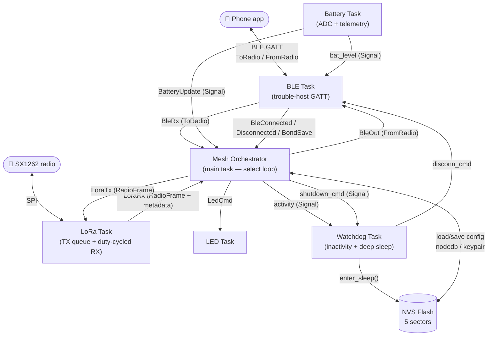
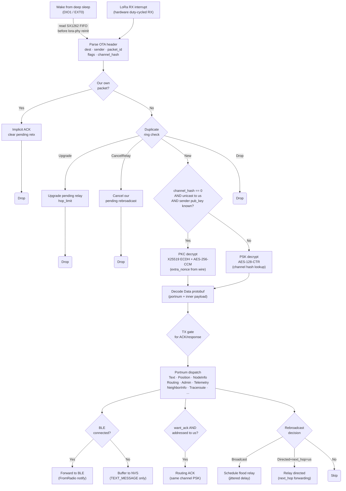
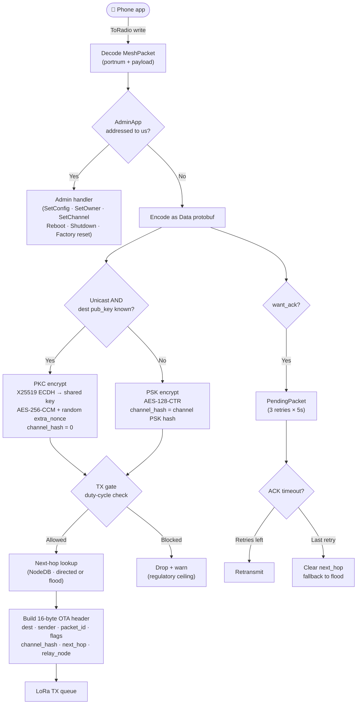
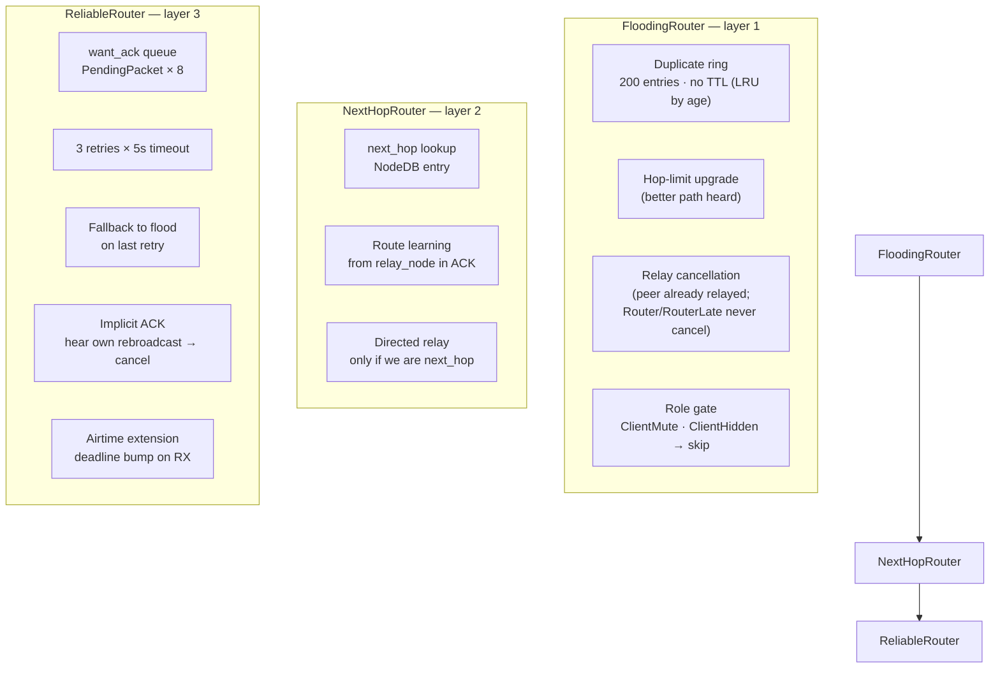
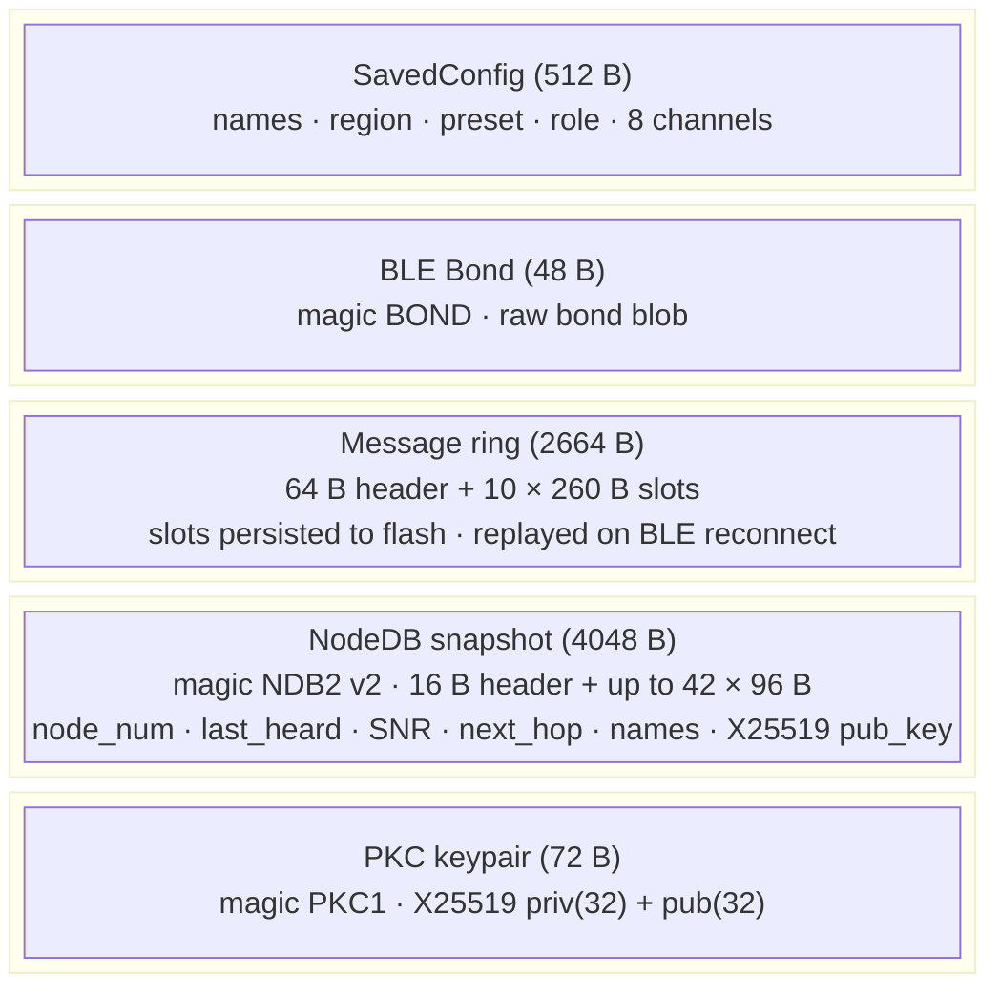
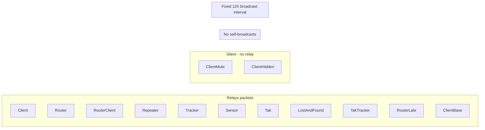

# Meshtastenstein

Meshtastic protocol firmware in Rust, currently supporting the **Heltec WiFi LoRa 32 V3** (ESP32-S3 + SX1262, runs on real hardware) and the **Seeed XIAO nRF52840 + Wio-SX1262** (feature-complete, never run on real hardware). Most of this document — hardware target details, the build steps, the hardware test checklist — covers the ESP32 board specifically; see [Layout](#layout) for where the nRF52 board differs.

A from-scratch implementation of the Meshtastic mesh networking protocol stack — radio, BLE, crypto, hierarchical routing, node management, and config persistence — written entirely in `no_std` Rust using the Embassy async executor.

---

## Hardware Target

| Component | Details |
|-----------|---------|
| MCU | ESP32-S3 (dual-core Xtensa LX7, 512 KB DRAM) |
| Radio | SX1262 LoRa transceiver |
| Board | Heltec WiFi LoRa 32 V3 |
| Toolchain | Xtensa ESP (`esp` channel via `rust-toolchain.toml`) |

### Pin mapping

| Signal | GPIO |
|--------|------|
| LoRa SPI SCK | 9 |
| LoRa SPI MISO | 11 |
| LoRa SPI MOSI | 10 |
| LoRa CS | 8 |
| LoRa RESET | 12 |
| LoRa DIO1 | 14 |
| LoRa BUSY | 13 |
| LED | 35 |
| Battery ADC | GPIO1 (ADC1) |
| Battery ADC ctrl | GPIO37 |

---

## Resource Usage

One of this project's goals is to use fewer resources than the C++/FreeRTOS
upstream firmware — a single-owner Embassy async task in place of per-task
FreeRTOS stacks, fixed-capacity (`heapless`) hot state instead of heap-backed
containers, and an aggressive `opt-level='s'` + `lto='fat'` release profile.

| Board | Flash (`.text` + `.data`) | Static RAM (`.data` + `.bss`) |
|-------|---------------------------|-------------------------------|
| nRF52840 (XIAO + Wio-SX1262) | 415.1 KB | 144.5 KB |
| ESP32-S3 (Heltec WiFi LoRa V3) | *tracked in CI — see the "Report binary size" step's job summary on the latest `esp32` CI run* | — |

The nRF52840 number above was measured directly (`llvm-size` on a release
build of the current bring-up milestone, now feature-complete: radio, BLE,
flash storage, mesh orchestrator, battery and watchdog are all wired up).
The BLE stack accounts for most of the jump from the LoRa-only milestone
(67 KB/68 KB): the vendored SoftDevice Controller binary and GATT server
codegen are both substantial. The ESP32-S3
board needs the Xtensa linker to produce a binary, which isn't available on
every dev machine; both boards' CI jobs report their release binary's section
sizes in the workflow run's job summary on every push, so the current number
is always one click away rather than a claim to take on faith.

**Not yet measured:** a direct byte-for-byte comparison against upstream's
`.bin`, free-heap-at-runtime, and current draw on real hardware. NodeDB
capacity (96 in-RAM / 42 persisted) is currently *smaller* than upstream's
100–250 — see [Known Limitations](#whats-left--known-limitations) — so
"fewer resources" is a claim about the architecture, backed by real
binary-size numbers for this firmware, not yet a demonstrated win over
upstream specifically.

---

## Feature Coverage vs. Official Firmware

Complete inventory of the official Meshtastic C++ firmware's feature surface and
where this implementation stands. Compiled by reading upstream's source
(`meshtastic-firmware`), not its documentation.

| | Meaning |
|---|---|
| ✅ | Implemented and behaviour-compatible with upstream |
| ⚠️ | Partially implemented — see the note |
| ❌ | Not implemented |
| ➖ | Not applicable — hardware absent, or deliberately out of scope |

**Hardware verification caveat:** everything marked ✅ below is verified on the
**ESP32 board only** — the one board that has actually run on hardware. The
nRF52 board compiles, links, and shares all the protocol code, but has never
been run. Board-specific differences are called out where they exist.

### Radio & PHY

| Feature | Status | Notes |
|---|---|---|
| LoRa modem presets (9) | ✅ | ShortTurbo → LongSlow, all SF/BW/CR combinations |
| Region frequency plans | ✅ | Slot computed via djb2 channel-name hash, matching upstream |
| Sync word `0x2B` | ✅ | Written directly to SX1262 registers 0x0740/0x0741 after init |
| CRC, coding rate, TX power | ✅ | Per-region power limit applied |
| CAD before TX | ✅ | 2-symbol CAD, retry with backoff |
| Hardware duty-cycled RX | ✅ | *Exceeds upstream* — upstream's own 16-symbol preamble makes its `startReceiveDutyCycleAuto` degenerate to continuous RX (`sleepSymbols = 16 − 2×8 = 0`). The 64-symbol preamble here makes it actually engage (~16 % RX duty cycle) |
| Preamble length | ⚠️ | 64 symbols vs upstream's 16 — deliberate divergence enabling duty-cycled RX; costs ~4× preamble airtime. Stock receivers still lock on |
| TX airtime / duty-cycle limiting | ⚠️ | Polite + hard ceilings on a rolling 1-hour window, matching upstream's `AirTime`. Phone-initiated sends currently bypass the gate |
| Channel-utilization measurement | ✅ | Rolling window over TX + RX airtime |
| Contention window / TX jitter | ✅ | `CWmin=3`/`CWmax=8`, SNR-scaled, including upstream's ROUTER head start |
| 2.4 GHz (SX1280) | ➖ | SX1262 hardware only |
| Multiple radio backends (RF95, LR11x0, …) | ➖ | SX1262 only by design |

### Packet format & cryptography

| Feature | Status | Notes |
|---|---|---|
| 16-byte OTA header | ✅ | Byte-for-byte match, incl. flags bit layout (hop_limit 2:0, want_ack 3, via_mqtt 4, hop_start 7:5) |
| `hop_start` / `hops_away` tracking | ✅ | Set on TX, derived on RX |
| `next_hop` / `relay_node` fields | ✅ | Last-byte node addressing, as upstream |
| AES-128/256-CTR channel encryption | ✅ | 16-byte nonce `packet_id(u64) ‖ sender ‖ 0`, matching `CryptoEngine::initNonce` |
| Channel PSK expansion (short-form) | ✅ | `[0x01]` → default PSK; 1-byte index form supported |
| Channel hash | ✅ | XOR-fold of name and expanded PSK |
| X25519 + AES-256-CCM (PKC) DMs | ✅ | SHA-256 of ECDH output as key, 8-byte tag, 12-byte overhead — matches `encryptCurve25519` |
| PKC portnum exclusions | ✅ | Traceroute/NodeInfo/Routing/Position never PKC-encrypted, as upstream requires |
| Ham / licensed mode | ❌ | `SetHamMode` admin unhandled; no plaintext-licensed operation |
| Manual public-key verification | ❌ | No `IS_KEY_MANUALLY_VERIFIED` bit; `AddContact` always overwrites a stored key |
| Text-message compression (portnum 7) | ➖ | Upstream's own encode/decode path is commented out; RX is accepted and forwarded uncompressed |

### Routing & mesh

| Feature | Status | Notes |
|---|---|---|
| FloodingRouter — duplicate suppression | ✅ | 200-entry history, no TTL, oldest-first eviction, as upstream |
| Relay-cancellation on overheard dupe | ✅ | Including role exemptions (ROUTER / ROUTER_LATE never cancel) |
| Hop-limit upgrade on better dupe | ✅ | Replaces a queued relay with the higher-hop-limit copy |
| Relayer tracking | ✅ | 6 relayers per packet (upstream `NUM_RELAYERS`) |
| NextHopRouter — directed relay | ✅ | Relays only when unset next_hop or we are the designated hop |
| Route learning from ACKs | ⚠️ | Learns `next_hop` from ACK relay_node, but without upstream's "was also a relayer of the original" corroboration |
| ReliableRouter — want_ack retransmit | ✅ | 3 retries × 5 s, flood fallback on last retry |
| Implicit ACK (overheard rebroadcast) | ✅ | Cancels pending retransmission |
| Relay queue depth | ✅ | 8 concurrent pending rebroadcasts (upstream `MAX_TX_QUEUE` is 16) |
| Intermediate-node retransmission | ❌ | Upstream's `NUM_INTERMEDIATE_RETX` path for relayed (not originated) packets is absent |
| `RebroadcastMode` enforcement | ❌ | All 6 variants ignored; a node set to `NONE` still rebroadcasts |
| Ignored-node filtering on RX | ❌ | `is_ignored` is stored and shown to the phone but never drops incoming traffic |
| TX priority queue | ❌ | No priority ordering of queued transmissions |
| `Routing` error/NAK inspection | ❌ | A NAK is treated the same as an ACK |
| MQTT bridging | ❌ | No MQTT; `via_mqtt` parsed but never acted on |

### Device roles

All 13 roles are accepted and persisted; what differs is how much
role-specific *behaviour* each one drives. See [Device Roles](#device-roles)
below for this firmware's exact per-role relay and broadcast behaviour.

| Role | Upstream parity | Gap |
|---|---|---|
| `Client`, `ClientMute`, `ClientHidden`, `Router`, `RouterClient` | ✅ | — |
| `RouterLate` | ⚠️ | Never cancels a relay (correct), but no late-rebroadcast window clamping |
| `Repeater` | ⚠️ | Suppresses own broadcasts; otherwise relays like `Client` |
| `Tracker`, `Sensor`, `TakTracker` | ⚠️ | No role-specific position/telemetry cadence, no duty-cycle sleep |
| `ClientBase` | ❌ | Behaves as `Client` — no favourite-node relay exemption |
| `Tak`, `LostAndFound` | ❌ | No role-specific behaviour |
| Favourite-router hop preservation | ❌ | Upstream's free router-to-favourite-router hop is absent |

### Application modules (portnums)

| Portnum | Module | Upstream | This firmware |
|---|---|---|---|
| 1 | TextMessage | ✅ | ✅ TX + RX, buffered for BLE replay |
| 2 | RemoteHardware | ✅ | ⚠️ Decoded and forwarded; no GPIO execution |
| 3 | Position | ✅ | ✅ RX → NodeDB; periodic re-broadcast of phone position |
| 4 | NodeInfo | ✅ | ✅ TX + RX, public key exchange |
| 5 | Routing | ✅ | ⚠️ ACK handling only |
| 6 | Admin | ✅ | ⚠️ 24 of ~39 request variants |
| 7 | TextMessageCompressed | ➖ | ➖ Disabled upstream too |
| 8 | Waypoint | ✅ | ⚠️ Decoded and forwarded; not stored |
| 9 | Audio | ✅ | ❌ |
| 10 | DetectionSensor | ✅ | ❌ |
| 11 | Alert | ✅ | ❌ |
| 12 | KeyVerification | ✅ | ❌ |
| 32 | Reply | ✅ | ❌ |
| 34 | Paxcounter | ✅ | ❌ |
| 36 | NodeStatus | ✅ | ❌ |
| 64 | Serial | ✅ | ❌ |
| 65 | StoreForward | ✅ | ⚠️ Local BLE-replay buffer only; not the mesh store-forward protocol |
| 66 | RangeTest | ✅ | ❌ |
| 67 | Telemetry | ✅ | ⚠️ Device metrics TX + RX; no environment / air-quality / power / health sensors |
| 70 | Traceroute | ✅ | ⚠️ Replies at destination; no `route_back`/`snr_back`, no transit-hop appending |
| 71 | NeighborInfo | ✅ | ✅ TX + RX |
| 72 | AtakPlugin | ✅ | ❌ |
| 73 | MapReport | ✅ | ❌ Requires MQTT |
| 74 | PowerStress | ✅ | ❌ |
| 13, 33, 35, 68, 69, 75–78, 112, 256, 257 | *(reserved / niche)* | ➖ | ➖ No upstream module either, or platform-specific |

Unhandled portnums are still forwarded to the phone over BLE, so nothing is
silently lost — they simply have no on-device behaviour.

### Admin messages

| Group | Implemented | Missing |
|---|---|---|
| **Get** | `GetOwner`, `GetConfig`, `GetModuleConfig`, `GetChannel` | `GetDeviceMetadata`, `GetDeviceConnectionStatus`, `GetUIConfig`, `GetCannedMessages`, `GetRingtone`, `GetNodeRemoteHardwarePins` |
| **Set** | `SetOwner`, `SetConfig`, `SetModuleConfig` *(acknowledged, not stored)*, `SetChannel` | `SetHamMode`, `SetTimeOnly`, `SetCannedMessages`, `SetRingtone`, `StoreUIConfig`, `SetScale` |
| **Node DB** | `RemoveByNodenum`, `AddContact`, `Set`/`RemoveFavoriteNode`, `Set`/`RemoveIgnoredNode`, `ToggleMutedNode`, `Set`/`RemoveFixedPosition`, `NodedbReset` | — |
| **Lifecycle** | `RebootSeconds`, `ShutdownSeconds`, `FactoryResetConfig` | `FactoryResetDevice`, `RebootOtaSeconds`, `EnterDfuMode`, `OtaRequest`, `ExitSimulator` |
| **Transactions & files** | `BeginEditSettings`, `CommitEditSettings` | `DeleteFile`, `Backup`/`Restore`/`RemoveBackupPreferences` |
| **Other** | — | `SendInputEvent`, `KeyVerification`, `LockdownAuth`, `SensorConfig` |

Session passkey: 8 random bytes with a 300 s expiry, matching upstream.
`BeginEditSettings`/`CommitEditSettings` are acknowledged but carry no
transaction semantics — each setter persists immediately.

### Configuration

| Config type | Stored & honoured | Notes |
|---|---|---|
| `LoRa` | ⚠️ | `region` + `modem_preset` persisted; `hop_limit`, `tx_power`, `channel_num`, `tx_enabled`, custom SF/BW/CR ignored |
| `Device` | ⚠️ | `role` persisted; reported correctly by `GetConfig` but sent as default during config exchange |
| `Bluetooth` | ⚠️ | Hardcoded enabled + random PIN; not configurable |
| `Sessionkey` | ✅ | Empty message |
| `Position`, `Power`, `Network`, `Display`, `Security`, `DeviceUi` | ❌ | Returned as defaults; no storage |
| All 14 `ModuleConfig` types | ❌ | Returned as defaults; `SetModuleConfig` acknowledged but discarded |

Channels are the exception and are fully supported: 8 slots, per-channel PSK
and role, persisted to flash.

### Phone interface (BLE)

| Feature | Status | Notes |
|---|---|---|
| GATT service + ToRadio/FromRadio/FromNum | ✅ | MTU-correct exact-length reads |
| Secure pairing, PIN display, bonding | ✅ | Bond persisted across reboots |
| Fast connection-interval request | ✅ | Best-effort; some phones ignore peripheral requests |
| Config exchange sequence | ✅ | Full sequence the app's state machine requires |
| `ToRadio` packet / `want_config_id` | ✅ | |
| `ToRadio` heartbeat / disconnect | ❌ | Silently ignored |
| `ToRadio` XModem (file transfer) | ❌ | |
| `ToRadio` MQTT client proxy | ❌ | |
| Real delivery status to phone | ✅ | Genuine mesh ACK, or `MaxRetransmit` when retries are exhausted |
| Phone-side rate limiting | ❌ | Upstream throttles traceroute (30 s), position/telemetry (10 s), text (2 s) |
| `LogRadio` debug-log characteristic | ❌ | Serial logging (`RUST_LOG=debug`) is the debug path here |
| Serial / USB console API | ❌ | No `StreamAPI`; BLE is the only phone transport |
| FileManifest in config exchange | ⚠️ | Sent empty — accepted by current app versions |

### Node database & persistence

| Feature | Status | Notes |
|---|---|---|
| In-RAM NodeDB | ✅ | 96 nodes (upstream: 80–100 typical) |
| Persisted NodeDB snapshot | ⚠️ | Top 42 nodes — hard single-flash-sector limit vs upstream's 100–250 |
| Per-node public key persistence | ✅ | Restored across reboots |
| Favourite / ignored / muted flags | ✅ | Persisted |
| Position in NodeDB | ⚠️ | Tracked in RAM, deliberately not persisted (flash wear) |
| Per-node telemetry (battery, util) | ❌ | Received and forwarded, but not stored per node |
| Stale-node eviction | ⚠️ | Predicate exists but never fires — there is no clock, so `last_heard` is always 0 (see below) |
| Config / channels / bond persistence | ✅ | Dedicated flash sectors |
| Backup & restore preferences | ❌ | |

### Time

| Feature | Status | Notes |
|---|---|---|
| RTC / wall-clock time | ❌ | No time source anywhere in the firmware |
| Time sync from phone or mesh | ❌ | `SetTimeOnly` unhandled |
| Consequences | ⚠️ | `last_heard` is always 0, so the phone shows nodes as never-heard, NodeDB snapshot ordering is arbitrary, and stale eviction never prunes — once 96 nodes are known, new ones are dropped |

### Power management

| Feature | Status | Notes |
|---|---|---|
| Deep sleep on inactivity | ✅ | ESP32 only — 5 min, with pre-sleep NodeDB flush |
| Low-battery auto-sleep | ✅ | Both boards |
| Admin-requested shutdown | ✅ | Both boards |
| Wake on LoRa RX | ⚠️ | ESP32 only, via DIO1/EXT0. Implemented but **unverified on hardware**; upstream deliberately abandoned this approach |
| Wake on button | ✅ | ESP32 only |
| nRF52 System Off | ✅ | No wake source on this board by design, so inactivity sleep is disabled there |
| Hardware watchdog | ✅ | Both boards |
| Battery level & voltage | ✅ | OCV lookup table, shared by both boards |
| Light sleep / full PowerFSM | ❌ | Upstream's multi-state power FSM (`ON`/`DARK`/`NB`/`LS`/`SDS`…) is not modelled |
| Duty-cycle sleep for Tracker/Sensor roles | ❌ | |

### Hardware peripherals

| Feature | Status | Notes |
|---|---|---|
| LED status indication | ✅ | Heartbeat, RX and TX blink patterns |
| GPS receiver | ➖ | No GPS hardware on either board; position comes from the phone |
| Display / OLED / E-Ink | ➖ | Not driven — no UI, screen, or menu system |
| Buttons beyond wake | ➖ | Only the wake button is used |
| Keyboards, touch, rotary input | ➖ | |
| Buzzer / haptic feedback | ➖ | |
| Environmental / air-quality sensors | ➖ | None fitted |
| Accelerometer / motion | ➖ | |
| External notification (LED/buzzer/relay) | ❌ | |
| WiFi / Ethernet / MQTT / web server | ❌ | Radio and BLE only |

---

## Architecture

Three-layer design: `meshtastenstein-core/src/domain/` (pure protocol logic, no hardware), `tasks/` — shared task bodies in core plus each board's own `boards/*/src/tasks/` — and `boards/*/src/adapters/` (each board's hardware boundary). See [CLAUDE.md](CLAUDE.md) for the full module map.

### Task topology


```mermaid
graph TD
    PHONE(["📱 Phone app"])
    HW(["📡 SX1262 radio"])

    BLE["BLE Task<br/>(trouble-host GATT)"]
    MESH["Mesh Orchestrator<br/>(main task — select loop)"]
    LORA["LoRa Task<br/>(TX queue + duty-cycled RX)"]
    LED["LED Task"]
    BAT["Battery Task<br/>(ADC + telemetry)"]
    WD["Watchdog Task<br/>(inactivity + deep sleep)"]
    NVS[("NVS Flash<br/>5 sectors")]

    PHONE <-->|"BLE GATT<br/>ToRadio / FromRadio"| BLE
    HW <-->|"SPI"| LORA

    BLE -->|"BleRx (ToRadio)"| MESH
    MESH -->|"BleOut (FromRadio)"| BLE
    LORA -->|"LoraRx (RadioFrame + metadata)"| MESH
    MESH -->|"LoraTx (RadioFrame)"| LORA
    MESH -->|"LedCmd"| LED
    BAT -->|"BatteryUpdate (Signal)"| MESH
    BAT -->|"bat_level (Signal)"| BLE
    BLE -->|"BleConnected / Disconnected / BondSave"| MESH
    WD -->|"disconn_cmd"| BLE
    MESH -->|"activity (Signal)"| WD
    MESH -->|"shutdown_cmd (Signal)"| WD
    WD -->|"enter_sleep()"| NVS
    MESH <-->|"load/save config<br/>nodedb / keypair"| NVS
```

### Packet receive pipeline


```mermaid
flowchart TD
    WAKE["Wake from deep sleep<br/>(DIO1 / EXT0)"]
    RX["LoRa RX interrupt<br/>(hardware duty-cycled RX)"]

    WAKE -->|"read SX1262 FIFO<br/>before lora-phy reinit"| PARSE
    RX --> PARSE["Parse OTA header<br/>dest · sender · packet_id<br/>flags · channel_hash"]

    PARSE --> OWN{Our own<br/>packet?}
    OWN -- Yes --> IACK["Implicit ACK<br/>clear pending retx"] --> DROP1(Drop)
    OWN -- No --> DUP{Duplicate<br/>ring check}
    DUP -- New --> CRYPT{channel_hash == 0<br/>AND unicast to us<br/>AND sender pub_key known?}
    DUP -- Upgrade --> UPG["Upgrade pending relay<br/>hop_limit"] --> DROP2(Drop)
    DUP -- CancelRelay --> CANCEL["Cancel our<br/>pending rebroadcast"] --> DROP3(Drop)
    DUP -- Drop --> DROP4(Drop)

    CRYPT -- Yes --> PKC["PKC decrypt<br/>X25519 ECDH + AES-256-CCM<br/>(extra_nonce from wire)"]
    CRYPT -- No --> PSK["PSK decrypt<br/>AES-128-CTR<br/>(channel hash lookup)"]

    PKC --> DECODE
    PSK --> DECODE["Decode Data protobuf<br/>(portnum + inner payload)"]

    DECODE --> DUTY{TX gate<br/>for ACK/response}
    DUTY --> DISPATCH["Portnum dispatch<br/>Text · Position · NodeInfo<br/>Routing · Admin · Telemetry<br/>NeighborInfo · Traceroute · ..."]

    DISPATCH --> FWD{BLE<br/>connected?}
    FWD -- Yes --> BLE_FWD["Forward to BLE<br/>(FromRadio notify)"]
    FWD -- No --> BUF["Buffer to NVS<br/>(TEXT_MESSAGE only)"]

    DISPATCH --> ACK{want_ack AND<br/>addressed to us?}
    ACK -- Yes --> SEND_ACK["Routing ACK<br/>(same channel PSK)"]

    DISPATCH --> REBR{Rebroadcast<br/>decision}
    REBR -- Broadcast --> FLOOD["Schedule flood relay<br/>(jittered delay)"]
    REBR -- Directed+next_hop=us --> RELAY["Relay directed<br/>(next_hop forwarding)"]
    REBR -- No --> SKIP(Skip)
```

### Packet send pipeline (BLE → LoRa)


```mermaid
flowchart TD
    PHONE(["📱 Phone app"])
    PHONE -->|"ToRadio write"| DECODE["Decode MeshPacket<br/>(portnum + payload)"]

    DECODE --> ADMIN{AdminApp<br/>addressed to us?}
    ADMIN -- Yes --> ADMIN_H["Admin handler<br/>(SetConfig · SetOwner · SetChannel<br/>Reboot · Shutdown · Factory reset)"]
    ADMIN -- No --> ENCODE["Encode as Data protobuf"]

    ENCODE --> PKCQ{Unicast AND<br/>dest pub_key known?}

    PKCQ -- Yes --> PKC_TX["PKC encrypt<br/>X25519 ECDH → shared key<br/>AES-256-CCM + random extra_nonce<br/>channel_hash = 0"]
    PKCQ -- No --> PSK_TX["PSK encrypt<br/>AES-128-CTR<br/>channel_hash = channel PSK hash"]

    PKC_TX --> DUTY{TX gate<br/>duty-cycle check}
    PSK_TX --> DUTY

    DUTY -- Allowed --> NH["Next-hop lookup<br/>(NodeDB · directed or flood)"]
    DUTY -- Blocked --> WARN["Drop + warn<br/>(regulatory ceiling)"]

    NH --> HEADER["Build 16-byte OTA header<br/>dest · sender · packet_id · flags<br/>channel_hash · next_hop · relay_node"]
    HEADER --> LORA["LoRa TX queue"]

    ENCODE --> TRACK{want_ack?}
    TRACK -- Yes --> PENDING["PendingPacket<br/>(3 retries × 5s)"]
    PENDING --> TIMEOUT{ACK timeout?}
    TIMEOUT -- "Retries left" --> RESEND["Retransmit"]
    TIMEOUT -- "Last retry" --> FALLBACK["Clear next_hop<br/>fallback to flood"]
```

### Routing layer


```mermaid
graph TB
    subgraph "FloodingRouter — layer 1"
        DD["Duplicate ring<br/>200 entries · no TTL (LRU by age)"]
        HU["Hop-limit upgrade<br/>(better path heard)"]
        RC["Relay cancellation<br/>(peer already relayed;<br/>Router/RouterLate never cancel)"]
        RB["Role gate<br/>ClientMute · ClientHidden → skip"]
    end

    subgraph "NextHopRouter — layer 2"
        NL["next_hop lookup<br/>NodeDB entry"]
        RL["Route learning<br/>from relay_node in ACK"]
        DR["Directed relay<br/>only if we are next_hop"]
    end

    subgraph "ReliableRouter — layer 3"
        WA["want_ack queue<br/>PendingPacket × 8"]
        RT["3 retries × 5s timeout"]
        FB["Fallback to flood<br/>on last retry"]
        IA["Implicit ACK<br/>hear own rebroadcast → cancel"]
        AE["Airtime extension<br/>deadline bump on RX"]
    end

    FloodingRouter --> NextHopRouter --> ReliableRouter
```

### NVS flash layout

Offsets below are the ESP32 board's, relative to the start of its NVS
partition. The record layouts themselves (magic numbers, versions, field
sizes) are shared with the nRF52 board via `domain::persistence`; only the
base address differs — the nRF52 board's 5 sectors sit at `0xEF000` and up
(see `boards/nrf52/memory.x`), just below its UF2 bootloader.


```mermaid
block-beta
  columns 1
  block:S0["Sector 0 · 0x0000"]:1
    C["SavedConfig (512 B)<br/>names · region · preset · role · 8 channels"]
  end
  block:S1["Sector 1 · 0x1000"]:1
    B["BLE Bond (48 B)<br/>magic BOND · raw bond blob"]
  end
  block:S2["Sector 2 · 0x2000"]:1
    R["Message ring (2664 B)<br/>64 B header + 10 × 260 B slots<br/>slots persisted to flash · replayed on BLE reconnect"]
  end
  block:S3["Sector 3 · 0x3000"]:1
    N["NodeDB snapshot (4048 B)<br/>magic NDB2 v2 · 16 B header + up to 42 × 96 B<br/>node_num · last_heard · SNR · next_hop · names · X25519 pub_key"]
  end
  block:S4["Sector 4 · 0x4000"]:1
    K["PKC keypair (72 B)<br/>magic PKC1 · X25519 priv(32) + pub(32)"]
  end
```

---

## Device Roles

The role is set via `SetConfig(Device)` from the phone app and persisted to NVS. It controls two things: whether the device relays received packets, and how often it broadcasts its own periodic messages.

| Role | Value | Rebroadcast | Periodic broadcasts | Notes |
|------|-------|-------------|---------------------|-------|
| `Client` | 0 | Yes | 3 h NodeInfo, 15 min Position, 60 min Telemetry, 6 h NeighborInfo (congestion-scaled) | **Default** |
| `ClientMute` | 1 | **No** | Same intervals as Client | Receives packets but never relays — use when you don't want to consume airtime for others |
| `Router` | 2 | Yes | Fixed 12 h (all types, no congestion scaling) | Maximum relay priority — always forwards, long broadcast intervals to reduce airtime |
| `RouterClient` | 3 | Yes | Fixed 12 h (same as Router) | *(deprecated in proto but handled)* |
| `Repeater` | 4 | Yes | **Suppressed (0)** | Relay-only — forwards packets but never announces itself *(deprecated in proto)* |
| `Tracker` | 5 | Yes | Congestion-scaled (same as Client) | Duty-cycle sleep not implemented — behaves like Client |
| `Sensor` | 6 | Yes | Congestion-scaled (same as Client) | Duty-cycle sleep not implemented — behaves like Client |
| `Tak` | 7 | Yes | Congestion-scaled (same as Client) | |
| `ClientHidden` | 8 | **No** | **Suppressed (0)** | Fully silent — no relay, no self-announcements; useful for covert or ultra-low-airtime operation |
| `LostAndFound` | 9 | Yes | Congestion-scaled (same as Client) | |
| `TakTracker` | 10 | Yes | Congestion-scaled (same as Client) | |
| `RouterLate` | 11 | Yes | Congestion-scaled (same as Client) | Never cancels a scheduled rebroadcast (see routing layer) |
| `ClientBase` | 12 | Yes | Congestion-scaled (same as Client) | Behaves like `Client` — favorite-node relay semantics not implemented (see Known Limitations) |

### Role behaviour summary


```mermaid
graph LR
    subgraph Relays packets
        Client
        Router
        RouterClient
        Repeater
        Tracker
        Sensor
        Tak
        LostAndFound
        TakTracker
        RouterLate
        ClientBase
    end
    subgraph Silent - no relay
        ClientMute
        ClientHidden
    end
    subgraph No self-broadcasts
        Repeater
        ClientHidden
    end
    subgraph Fixed 12h broadcast interval
        Router
        RouterClient
    end
```

Tracker/Sensor/TAK duty-cycle sleep is **not implemented** — these roles currently behave identically to `Client` aside from the role field being reported in NodeInfo. For implementation details see [CLAUDE.md](CLAUDE.md).

---

## Key Protocol Details

| Parameter | Value |
|-----------|-------|
| Sync word | 0x2B (SX1262 regs 0x0740=0x24, 0x0741=0xB4) |
| Preamble | 64 symbols (TX + RX, both boards; upstream Meshtastic uses 16 — a deliberate project-wide divergence, kept for the wider RX detection margin it gives on the ESP32 board's wake-on-LoRa path, though the nRF52 board has no such path. Still detected by stock 16-symbol receivers, at the cost of roughly 4x the per-packet preamble airtime) |
| Default preset | LongFast: SF11, BW 250 kHz, CR 4/5 |
| Default region | EU_433 — 433.875 MHz (slot 3) |
| OTA header | 16 bytes: dest(4) + sender(4) + packet_id(4) + flags(1) + channel_hash(1) + next_hop(1) + relay_node(1) |
| Channel encryption | AES-128-CTR · nonce = packet_id (u64 LE) + sender (u32 LE) + zeros (4) |
| PKC encryption | X25519 ECDH → SHA-256(shared secret) as key → AES-256-CCM · nonce = packet_id(4) + extra_nonce(4) + sender(4) + 0x00 · tag 8 B · overhead 12 B · channel_hash = 0 |
| Default PSK | `d4f1bb3a20290759f0bcffabcf4e6901` |
| BLE service UUID | `6ba1b218-15a8-461f-9fa8-5dcae273eafd` |
| ToRadio char | `f75c76d2-129e-4dad-a1dd-7866124401e7` (write) |
| FromRadio char | `2c55e69e-4993-11ed-b878-0242ac120002` (read) |
| FromNum char | `ed9da18c-a800-4f66-a670-aa7547e34453` (read + notify) |
| BLE MTU | Android negotiates 508; replies use exact byte length (no zero-padding) |
| NVS layout (ESP32; nRF52 shares the record formats, different base offset — see [NVS flash layout](#nvs-flash-layout)) | Sector 0: SavedConfig 0x0000 (512 B) · Sector 1: Bond 0x1000 (48 B) · Sector 2: msg ring 0x2000 (2664 B) · Sector 3: NodeDB 0x3000 (4048 B, NDB2 v2) · Sector 4: PKC keypair 0x4000 (72 B) |

### Region frequency table (LongFast / BW 250 kHz)

| Region | Code | Default slot | Frequency |
|--------|------|-------------|-----------|
| US | 1 | 19 | 906.875 MHz |
| EU_433 | 2 | 3 | 433.875 MHz |
| EU_868 | 3 | 0 | 869.525 MHz |
| ANZ | 6 | 19 | 919.875 MHz |

Slot is `djb2(preset_display_name) % num_channels`, where `num_channels = band_hz / bandwidth_hz`;
frequency is `freq_start_hz + bandwidth_hz / 2 + slot × bandwidth_hz`. For LongFast,
`djb2("LongFast") = 130429955`. EU_868's band is a single 250 kHz channel, so its slot is
always 0.

---

## Layout

The repository holds independent crates, not a Cargo workspace — the boards need
different compilers (Xtensa vs. mainline Rust), so each crate carries its own
toolchain file, target configuration, lockfile, lint settings and CI job.

| Path | What it is | Toolchain |
| --- | --- | --- |
| `meshtastenstein-core/` | Hardware-agnostic library: protocol, routing, crypto, persistence, port traits | stable |
| `boards/esp32/` | Heltec WiFi LoRa V3 binary: radio, BLE, flash, battery, watchdog drivers | `esp` (Xtensa) |
| `boards/nrf52/` | Seeed XIAO nRF52840 + Wio-SX1262 — feature-complete, **never run on hardware**, see below | stable (`thumbv7em-none-eabihf`) |

The nRF52840 board now has the same feature set as the ESP32 board: pinout,
memory layout, port adapters, LoRa, BLE GATT, flash storage, the mesh
orchestrator, battery monitoring and a hardware watchdog. It has not been
run on hardware.

Build from inside a crate directory; there is no top-level `cargo build`.

## Build

### ESP32 (Heltec WiFi LoRa V3)

Requires the Xtensa ESP Rust toolchain:

```bash
# Install espup if needed
cargo install espup
espup install

# Check the hardware-agnostic core on stable
cd meshtastenstein-core
cargo check

# Build + flash the board (requires espflash and the Xtensa toolchain active)
cd boards/esp32
cargo build --release
espflash flash --monitor target/xtensa-esp32s3-none-elf/release/meshtastenstein-esp32
```

Set log level via environment variable before flashing:
```bash
RUST_LOG=debug cargo build --release
```

### nRF52 (Seeed XIAO nRF52840 + Wio-SX1262)

Builds on mainline `stable` — no special toolchain install needed, just the
`thumbv7em-none-eabihf` target:

```bash
rustup target add thumbv7em-none-eabihf

cd boards/nrf52
cargo build --release
```

This board has never been run on hardware. Flashing is drag-and-drop over the
UF2 bootloader (double-tap reset to enter it) once a `.uf2` is produced from
the release ELF; there is no `espflash`-equivalent wired up in this repo yet.

### Protobuf generation

Protobufs live as a git submodule at `proto/meshtastic-protobufs/`. Generated Rust types land in `meshtastenstein-core/src/proto/`. To regenerate:

```bash
git submodule update --init
cd meshtastenstein-core
cargo build  # triggers build.rs → prost-build
```

---

## Hardware Test Checklist

Written for and tested against the **ESP32 board**. The nRF52 board would
need an equivalent pass once it's run on real hardware for the first time —
none of the items below have been checked against it.

### P0 — Boot & Connectivity

- [ ] **Cold boot**: device powers on, serial log shows MAC, node number, region, preset, frequency
- [ ] **BLE advertising**: phone sees "Meshtastic_XXXX" in scan results
- [ ] **BLE pairing**: PIN displayed on serial, phone pairs successfully
- [ ] **Config exchange**: app reaches "connected" state (MyNodeInfo through ConfigCompleteId sequence)
- [ ] **Bond persistence**: reboot device, phone reconnects without re-pairing
- [ ] **LoRa frequency**: log line `[LoRa] Entering RX mode (duty-cycled|continuous) at X Hz` matches expected formula

### P0 — LoRa Radio

- [ ] **LoRa TX**: send text message from phone, verify `[LoRa] TX` log with correct frequency
- [ ] **LoRa RX**: receive packet from another Meshtastic node, verify `[Mesh] RX` log with sender/dest/id
- [ ] **Duty-cycled RX reliability**: with the node otherwise idle, send several packets from a second node at varying, non-synchronized intervals (including one timed to start just as the receiver's duty cycle would enter its sleep window) and confirm every packet is received — the wake window is sized to catch this worst case, but it's worth confirming against a real transmitter rather than only the math. Ideally pair with a current probe on the receiving node to confirm the idle draw actually drops relative to a build with `RxMode::Continuous` forced
- [ ] **Sync word / preamble**: confirm interop with C++ firmware nodes (packets decoded, not ignored) — including verifying the 64-symbol TX preamble is still decoded correctly by stock 16-symbol-preamble receivers
- [ ] **Encryption round-trip**: send encrypted text on default PSK, verify other node decrypts correctly
- [ ] **Secondary channel**: configure a secondary channel with custom PSK, send/receive on it

### P0 — Routing

- [ ] **Flood rebroadcast**: receive broadcast packet with hop_limit > 0, verify rebroadcast after SNR-based delay
- [ ] **Duplicate detection**: send same packet twice (same sender + packet_id), verify second is dropped
- [ ] **Hop-limit upgrade**: receive duplicate with higher hop_limit, verify pending rebroadcast upgraded
- [ ] **Relay cancellation**: hear another node relay a packet we queued, verify our rebroadcast cancelled
- [ ] **want_ack + ACK**: send text to specific node, verify routing ACK received and pending cleared
- [ ] **Route learning**: after ACK, verify `[Router] Update next hop` log, subsequent sends use learned next_hop
- [ ] **Directed relay**: verify non-broadcast packet only relayed if we are the designated next_hop
- [ ] **Fallback to flood**: block ACK for 3 retries, verify last retry clears next_hop (floods)
- [ ] **Role-based skip**: set role to ClientMute, verify no rebroadcast of received packets

### P1 — Admin & Config

- [ ] **SetConfig(LoRa)**: change region + preset via app, verify NVS save + RebootSeconds reboot
- [ ] **SetConfig(Device)**: change role via app, verify periodic broadcast intervals change
- [ ] **SetOwner**: change long_name/short_name via app, verify persisted across reboot
- [ ] **SetChannel**: add secondary channel with custom name + PSK, verify in config exchange after reboot
- [ ] **FactoryReset**: trigger from app, verify device reboots with defaults (EU433, LongFast, default PSK)
- [ ] **NodeDBReset**: trigger from app, verify NodeDB cleared (config exchange shows no other nodes)
- [ ] **RebootSeconds(5)**: verify device reboots after 5 s, phone reconnects

### P1 — NodeDB & Mesh State

- [ ] **NodeDB population**: receive packets from multiple nodes, verify entries in config exchange NodeDB
- [ ] **hops_away tracking**: verify `hops_away = hop_start - hop_limit` populated in NodeDB entries
- [ ] **Stale eviction**: verify nodes not heard for > 2 h excluded from online count
- [ ] **NodeInfo request/reply**: receive NodeInfo with want_response, verify reply sent (throttled to 5 min)
- [ ] **Traceroute**: send traceroute request to this node, verify reply with our node_num + SNR appended

### P1 — Periodic Broadcasts

- [ ] **NodeInfo broadcast**: verify first broadcast ~30 s after boot, then every 3 h (or congestion-scaled)
- [ ] **Position relay**: send position from phone, verify re-broadcast to mesh every 15 min
- [ ] **Telemetry (LoRa)**: verify battery telemetry broadcast every 60 min (if channel_util < 25%)
- [ ] **Telemetry (BLE)**: verify battery level/voltage pushed to phone every 60 s
- [ ] **NeighborInfo**: verify broadcast every 6 h with neighbor list + SNR values
- [ ] **Congestion scaling**: with > 40 nodes in DB, verify broadcast intervals increase

### P0 — Regulatory (Duty Cycle)

- [ ] **EU_433 ceiling**: run 1 h on EU_433, log `air_util_tx` each minute, confirm ≤ 1 %
- [ ] **Polite gate**: with channel utilization synthetically > polite threshold, verify NodeInfo / Position / Telemetry / NeighborInfo broadcasts are suppressed
- [ ] **Impolite gate**: near regulatory ceiling, verify low-priority traffic dropped at `lora_send` while routing ACKs / admin responses still go out
- [ ] **Region switch**: change region via app, verify duty-cycle limit updates after reboot

### P1 — Power Management

- [ ] **Battery ADC**: verify serial log shows reasonable voltage (3.0 V–4.2 V on battery, ~4.5 V on USB)
- [ ] **Battery GATT**: verify phone shows battery percentage (BLE service 0x180F)
- [ ] **ShutdownSeconds**: send admin `ShutdownSeconds(5)`, verify device enters real deep sleep (no wake source) — does NOT software-reset
- [ ] **VEXT rail sanity check**: confirmed by reading upstream's own `variant.h` — VEXT powers only the OLED display and the LoRa antenna boost, not the SX1262 core supply, so it does not block wake-on-LoRa (no longer an open question; this row is just a sanity check that `deep_sleep_adapter.rs` still drives it correctly — high/off before sleep, low/on at boot)
- [ ] **DIO1 wakeup**: while sleeping, send LoRa packet, verify device wakes (EXT0) and reads FIFO. Set `RUST_LOG=debug` and capture serial output — look for `[SX1262-Direct] Wake poll #N: IRQ status=...` lines to see the full IRQ timeline, not just the final outcome
- [ ] **DIO1 wakeup — rapid multi-packet race**: put the device to sleep, then from a second Meshtastic node send 3 LoRa packets addressed to this node with ~500ms spacing between them. Confirm the device wakes and *all three* packets are eventually visible — check the serial log for three separate `[LoRa] Wake packet queued to mesh_in OK` (or equivalent) lines, not just one, and confirm via the phone app's message/NodeDB history after reconnecting that nothing was silently dropped. A single successful wake on the first packet with the second/third missing indicates the cold-boot wake-latency race described in Known Limitations is real
- [ ] **Button wakeup**: while sleeping, press GPIO 0, verify device wakes (EXT1)
- [ ] **Low battery sleep**: simulate battery < 5%, verify auto-sleep triggered
- [ ] **Watchdog**: verify heartbeat feed in logs (no unexpected resets under normal operation)

### P1 — Persistence (NodeDB + PKC Keypair)

- [ ] **NodeDB cold-boot restore**: onboard 3 peers, reboot, verify NodeDB reloads with node_num, last_heard, SNR, next_hop, short/long name
- [ ] **Debounced flush**: receive NodeInfo, verify dirty flag set, flush after 5 min debounce (or clean shutdown)
- [ ] **Factory reset clears sector 3**: trigger FactoryReset, verify NodeDB empty after reboot
- [ ] **Keypair persistence (sector 4)**: first boot logs "PKC keypair generated", subsequent boots log "PKC keypair loaded from flash"; priv/pub bytes identical across reboots
- [ ] **Keypair regen after erase**: manually erase sector 4, reboot, verify new keypair generated and saved

### P1 — PKC Direct Messages

- [ ] **Own pub_key in NodeInfo**: outgoing NodeInfo broadcast carries 32-byte `public_key` in `User`
- [ ] **Peer pub_key learned**: receive NodeInfo from peer, verify `NodeEntry.pub_key` populated
- [ ] **PKC encrypt outbound**: send DM to peer with known pub_key, verify `channel_hash=0` on wire and `[ct][tag 8][extra_nonce 4]` layout (plaintext + 12 bytes)
- [ ] **PKC decrypt inbound**: stock Android app sends secure DM, verify Rust node decrypts (PKC-first path when `channel_hash=0` + unicast + known sender key)
- [ ] **PSK fallback**: send DM to peer with no known pub_key, verify falls back to channel PSK
- [ ] **Bad tag rejection**: inject PKC frame with corrupted tag, verify `BadTag` returned and PSK path not incorrectly tried

### P1 — Admin GetConfig Variants

- [ ] **GetConfig(Device)**: returns `Device` variant with role
- [ ] **GetConfig(LoRa)**: returns `Lora` variant with region + modem_preset
- [ ] **GetConfig(Bluetooth)**: returns `Bluetooth` variant
- [ ] **GetConfig(Position / Power / Network / Display / Security / Sessionkey / DeviceUi)**: each returns its own variant (not a `Device` default) — app no longer hangs waiting for the correct type

### P2 — Store-and-Forward

- [ ] **Buffer on disconnect**: receive text message while BLE disconnected, verify NVS write log
- [ ] **Replay on connect**: reconnect phone, verify buffered messages delivered after config exchange
- [ ] **Buffer capacity**: buffer 10+ messages, verify oldest dropped (MAX_BUFFERED_MESSAGES = 10)

### P2 — Edge Cases

- [ ] **Channel hash collision**: configure two channels with same hash, verify correct channel selected
- [ ] **ACK on secondary channel**: send want_ack packet on secondary channel, verify ACK uses same channel PSK
- [ ] **Max payload**: send 239-byte payload (max after 16-byte header), verify no truncation
- [ ] **BLE TX queue full**: flood device with LoRa packets while BLE slow, verify graceful drop with warning log
- [ ] **Unknown portnum**: send packet with unrecognized portnum, verify warning log + no crash
- [ ] **Corrupted NVS**: erase NVS manually, boot device, verify defaults applied cleanly
- [ ] **LED indicators**: verify single blink on LoRa RX, double blink on BLE TX, 2 s heartbeat pulse

---

## What's Left / Known Limitations

| Item | Notes |
|------|-------|
| **LoRa frequency change without reboot** | By design — lora-phy doesn't support runtime reconfiguration; matches official firmware |
| **FileManifest in config exchange** | Sent empty; fine for current app versions |
| **Routing table convergence** | `next_hop` is learned from observed relay_node fields; correctness depends on seeing enough relay traffic |
| **Own position persistence** | `my_position_bytes` not saved to flash — intentional (flash wear from high-frequency GPS updates); re-populated on next phone connect. `SetFixedPosition` (admin) uses the same in-RAM field, so a fixed position is also lost on reboot until the phone reconnects and re-sends it — unlike upstream, which persists fixed positions to flash since they don't change per-GPS-fix |
| **Waypoint storage** | Received waypoints forwarded to BLE but not stored locally |
| **Tracker/Sensor duty-cycle sleep** | These roles currently behave like `Client`; no duty-cycle power management implemented |
| **NodeDB capacity vs. upstream** | 96 in-RAM / 42 NVS-persisted, vs. upstream's 100–250 depending on flash size. The in-RAM ceiling wasn't verified against actual heap usage on real hardware (this dev environment can't cross-compile for the Xtensa target); the NVS ceiling is a hard limit of the current single-sector, fixed-96-byte-record snapshot format |
| **`LogRadio` BLE characteristic** | Not implemented — upstream streams live firmware debug-log text to the phone app's log viewer over a dedicated characteristic (`5a3d6e49-...`). Diagnostic/developer feature only, no mesh-protocol data flows through it; this firmware's primary debug path is serial logging (`RUST_LOG=debug`) |
| **`CLIENT_BASE` role semantics** | Not implemented as a distinct role: no favorite-node auto-exemption from relay cancellation, no favorite-vs-not-favorite handling in `AddContact`/rebroadcast decisions. `CLIENT_BASE` currently behaves like `Client` |
| **Manual public-key verification** | Not implemented — upstream lets the phone mark a peer's public key as manually verified (`IS_KEY_MANUALLY_VERIFIED` bit), which then blocks `AddContact` from silently overwriting that key with an unverified one. This firmware has no such bit; `AddContact` always overwrites |
| **Deep-sleep wake-on-LoRa reliability** | Unverified on real hardware. Upstream deliberately does *not* wake from true deep sleep on a LoRa packet — a code comment in its source states this was tried and abandoned in favor of light sleep, because deep sleep requires powering down the radio. This firmware attempts the approach upstream walked away from. The open risk that VEXT might power the SX1262 and defeat wake-on-LoRa entirely has been resolved by reading upstream's own `variant.h`: VEXT powers only the OLED and the antenna boost, not the SX1262 core supply. The remaining open risk: the cold-boot wake latency (full Embassy/heap/GPIO reinit before `lora_task` reads the SX1262 buffer) leaves a window where a second incoming packet could overwrite the single-packet RX FIFO before it's read. **Recommended test**: send several LoRa packets in quick (sub-second) succession to a sleeping node and confirm all are recovered, not just the first, before relying on this for anything safety-relevant |

---

## Changelog

See [CHANGELOG.md](CHANGELOG.md) for a full history of changes.

---

## License

No license yet — private project.
